# BIMS Database ERDs and Table Flowcharts

This document describes the live `bims` database. It contains one ERD and one flowchart for every table, plus a full-database ERD. Diagrams are embedded as PNGs so they remain visible in Markdown previews that do not render Mermaid; the original Mermaid source is kept in collapsible sections.

To export all diagrams as high-resolution PNGs, run `npm --prefix tools/diagram-export install` and then `npm --prefix tools/diagram-export run export`. The images are written to `docs/diagram-png/`.

## Table of Contents

- [Whole Database ERD](#whole-database-erd)
- [Normalization Summary](#normalization-summary)
- [`households`](#households)
- [`resident_users`](#resident_users)
- [`resident_profiles`](#resident_profiles)
- [`resident_proof_documents`](#resident_proof_documents)
- [`admin_users`](#admin_users)
- [`service_types`](#service_types)
- [`service_requests`](#service_requests)
- [`request_status_history`](#request_status_history)
- [`notifications`](#notifications)
- [`community_concerns`](#community_concerns)
- [`concern_status_history`](#concern_status_history)
- [`concern_notifications`](#concern_notifications)

## Whole Database ERD

Mermaid source: Whole Database ERD

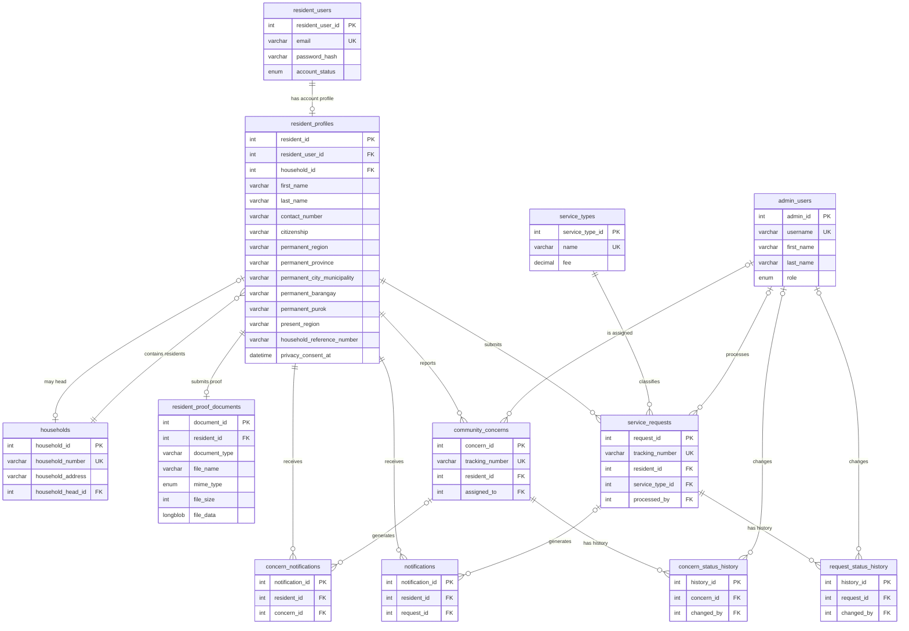
```mermaid
erDiagram
    resident_users ||--o| resident_profiles : "has account profile"
    households ||--o{ resident_profiles : "contains residents"
    resident_profiles o|--o| households : "may head"
    resident_profiles ||--o| resident_proof_documents : "submits proof"

    resident_profiles ||--o{ service_requests : "submits"
    service_types ||--o{ service_requests : "classifies"
    admin_users o|--o{ service_requests : "processes"
    service_requests ||--o{ request_status_history : "has history"
    admin_users o|--o{ request_status_history : "changes"
    resident_profiles ||--o{ notifications : "receives"
    service_requests o|--o{ notifications : "generates"

    resident_profiles ||--o{ community_concerns : "reports"
    admin_users o|--o{ community_concerns : "is assigned"
    community_concerns ||--o{ concern_status_history : "has history"
    admin_users o|--o{ concern_status_history : "changes"
    resident_profiles ||--o{ concern_notifications : "receives"
    community_concerns o|--o{ concern_notifications : "generates"

    resident_users {
        int resident_user_id PK
        varchar email UK
        varchar password_hash
        enum account_status
    }
    resident_profiles {
        int resident_id PK
        int resident_user_id FK
        int household_id FK
        varchar first_name
        varchar last_name
        varchar contact_number
        varchar citizenship
        varchar permanent_region
        varchar permanent_province
        varchar permanent_city_municipality
        varchar permanent_barangay
        varchar permanent_purok
        varchar present_region
        varchar household_reference_number
        datetime privacy_consent_at
    }
    resident_proof_documents {
        int document_id PK
        int resident_id FK
        varchar document_type
        varchar file_name
        enum mime_type
        int file_size
        longblob file_data
    }
    households {
        int household_id PK
        varchar household_number UK
        varchar household_address
        int household_head_id FK
    }
    admin_users {
        int admin_id PK
        varchar username UK
        varchar first_name
        varchar last_name
        enum role
    }
    service_types {
        int service_type_id PK
        varchar name UK
        decimal fee
    }
    service_requests {
        int request_id PK
        varchar tracking_number UK
        int resident_id FK
        int service_type_id FK
        int processed_by FK
    }
    request_status_history {
        int history_id PK
        int request_id FK
        int changed_by FK
    }
    notifications {
        int notification_id PK
        int resident_id FK
        int request_id FK
    }
    community_concerns {
        int concern_id PK
        varchar tracking_number UK
        int resident_id FK
        int assigned_to FK
    }
    concern_status_history {
        int history_id PK
        int concern_id FK
        int changed_by FK
    }
    concern_notifications {
        int notification_id PK
        int resident_id FK
        int concern_id FK
    }
```

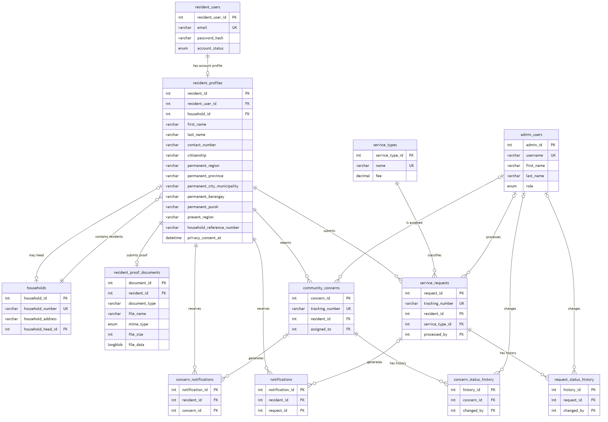

## Normalization Summary

- **1NF:** All tables use atomic columns and primary keys.
- **2NF:** Non-key attributes depend on each table's whole primary key.
- **3NF:** Resident and admin names are not redundantly stored where derived display values are needed; the resident mobile number is canonical and unique in `resident_profiles`; proof-document bytes are kept in a one-to-one table rather than repeating profile columns; service fees are maintained in `service_types`.
- **Foreign-key relationships:** Cascades remove dependent records where the dependent record has no meaning after its parent is deleted, such as service/concern history and request/concern notifications.

---

## households

**Purpose:** Stores household identity and location for resident grouping.

Mermaid source: households erd

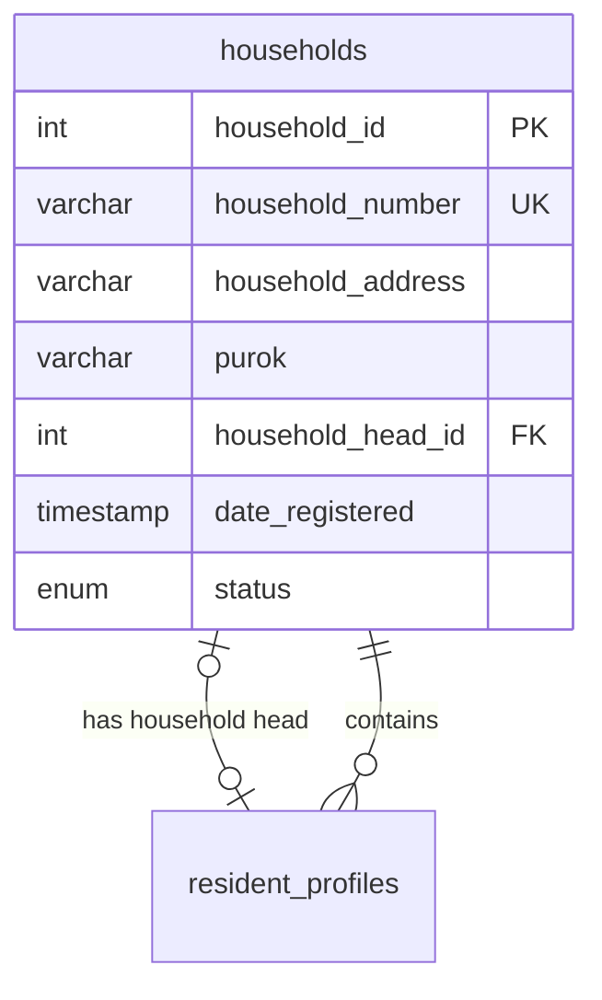
```mermaid
erDiagram
    households o|--o| resident_profiles : "has household head"
    households ||--o{ resident_profiles : "contains"

    households {
        int household_id PK
        varchar household_number UK
        varchar household_address
        varchar purok
        int household_head_id FK
        timestamp date_registered
        enum status
    }
```

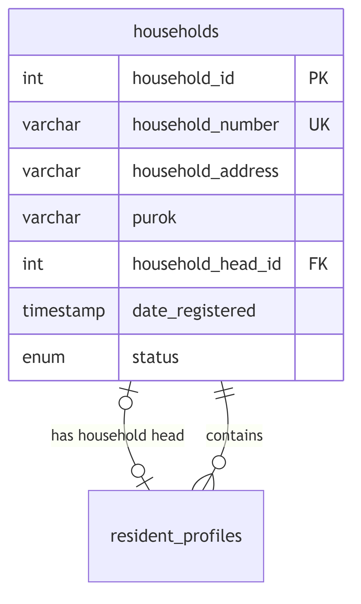

Mermaid source: households flowchart

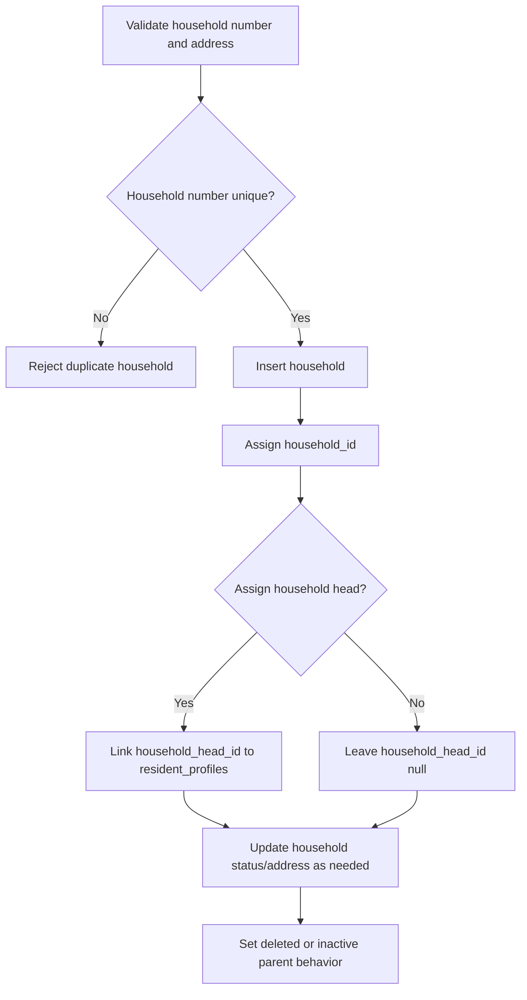
```mermaid
flowchart TD
    A[Validate household number and address] --> B{Household number unique?}
    B -->|No| C[Reject duplicate household]
    B -->|Yes| D[Insert household]
    D --> E[Assign household_id]
    E --> F{Assign household head?}
    F -->|Yes| G[Link household_head_id to resident_profiles]
    F -->|No| H[Leave household_head_id null]
    G --> I[Update household status/address as needed]
    H --> I
    I --> J[Set deleted or inactive parent behavior]
```

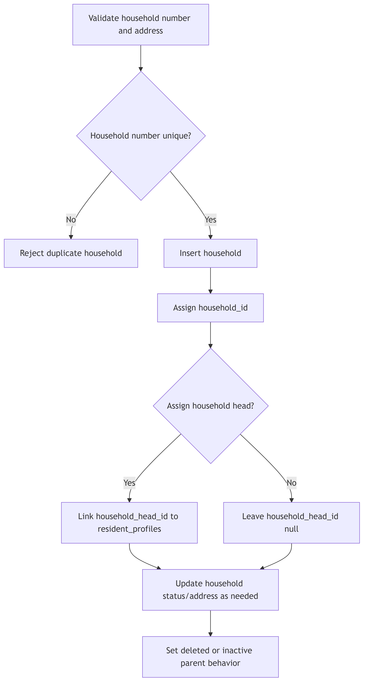

---

## resident_users

**Purpose:** Stores login credentials and account state. A resident's unique mobile number is the username and is stored as the canonical contact number in `resident_profiles`; email is optional.

Mermaid source: resident_users erd

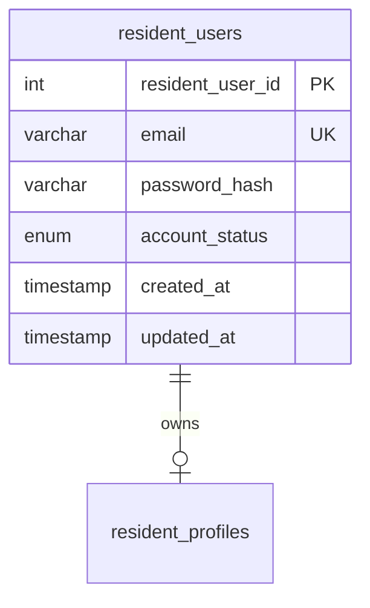
```mermaid
erDiagram
    resident_users ||--o| resident_profiles : "owns"

    resident_users {
        int resident_user_id PK
        varchar email UK
        varchar password_hash
        enum account_status
        timestamp created_at
        timestamp updated_at
    }
```

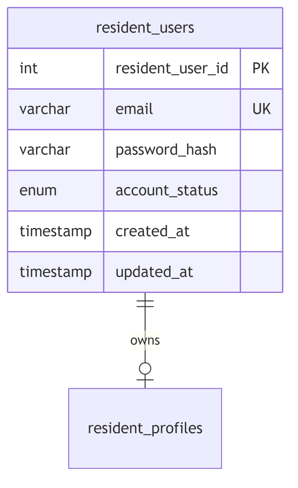

Mermaid source: resident_users flowchart

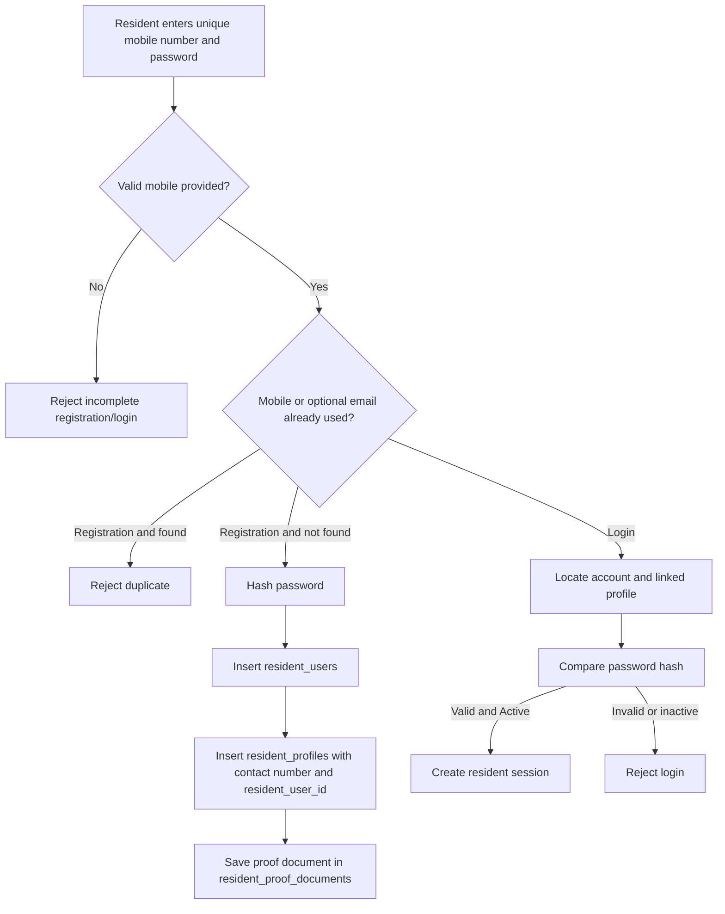
```mermaid
flowchart TD
    A[Resident enters unique mobile number and password] --> B{Valid mobile provided?}
    B -->|No| C[Reject incomplete registration/login]
    B -->|Yes| D{Mobile or optional email already used?}
    D -->|Registration and found| E[Reject duplicate]
    D -->|Login| F[Locate account and linked profile]
    D -->|Registration and not found| G[Hash password]
    G --> H[Insert resident_users]
    H --> I[Insert resident_profiles with contact number and resident_user_id]
    I --> J[Save proof document in resident_proof_documents]
    F --> K[Compare password hash]
    K -->|Valid and Active| L[Create resident session]
    K -->|Invalid or inactive| M[Reject login]
```

---

## resident_profiles

**Purpose:** Stores resident identity, demographics, structured permanent/present address, contact preferences, household details, consent time, and legacy emergency information. Age is derived from birth date and is not stored.

Mermaid source: resident_profiles erd

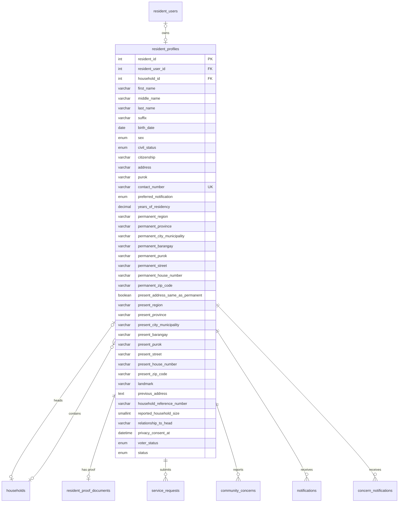
```mermaid
erDiagram
    resident_users o|--o| resident_profiles : "owns"
    households o|--o{ resident_profiles : "contains"
    resident_profiles o|--o| households : "heads"
    resident_profiles ||--o| resident_proof_documents : "has proof"
    resident_profiles ||--o{ service_requests : "submits"
    resident_profiles ||--o{ community_concerns : "reports"
    resident_profiles ||--o{ notifications : "receives"
    resident_profiles ||--o{ concern_notifications : "receives"

    resident_profiles {
        int resident_id PK
        int resident_user_id FK
        int household_id FK
        varchar first_name
        varchar middle_name
        varchar last_name
        varchar suffix
        date birth_date
        enum sex
        enum civil_status
        varchar citizenship
        varchar address
        varchar purok
        varchar contact_number UK
        enum preferred_notification
        decimal years_of_residency
        varchar permanent_region
        varchar permanent_province
        varchar permanent_city_municipality
        varchar permanent_barangay
        varchar permanent_purok
        varchar permanent_street
        varchar permanent_house_number
        varchar permanent_zip_code
        boolean present_address_same_as_permanent
        varchar present_region
        varchar present_province
        varchar present_city_municipality
        varchar present_barangay
        varchar present_purok
        varchar present_street
        varchar present_house_number
        varchar present_zip_code
        varchar landmark
        text previous_address
        varchar household_reference_number
        smallint reported_household_size
        varchar relationship_to_head
        datetime privacy_consent_at
        enum voter_status
        enum status
    }
```

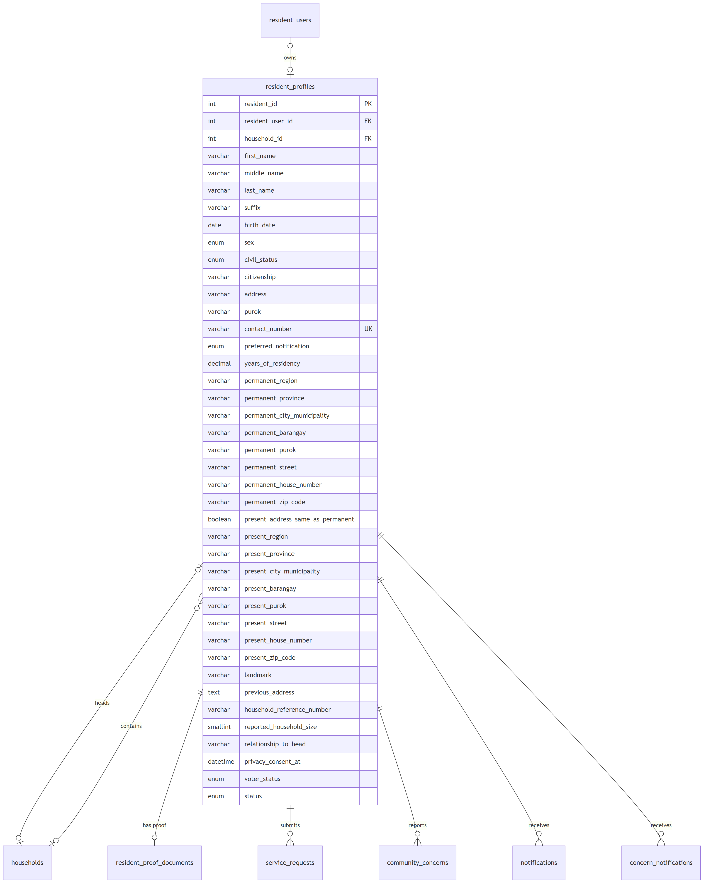

Mermaid source: resident_profiles flowchart

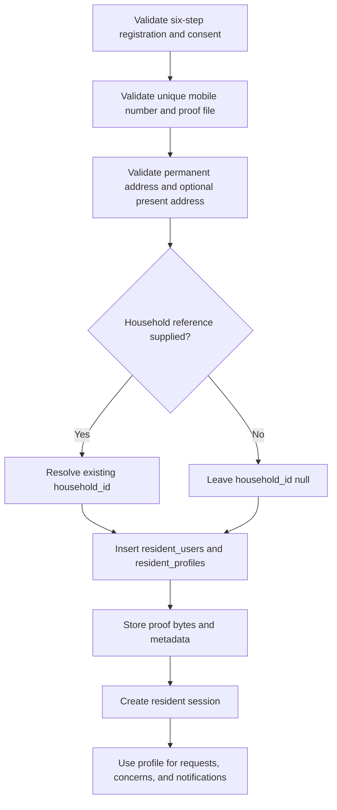
```mermaid
flowchart TD
    A[Validate six-step registration and consent] --> B[Validate unique mobile number and proof file]
    B --> C[Validate permanent address and optional present address]
    C --> D{Household reference supplied?}
    D -->|Yes| E[Resolve existing household_id]
    D -->|No| F[Leave household_id null]
    E --> G[Insert resident_users and resident_profiles]
    F --> G
    G --> H[Store proof bytes and metadata]
    H --> I[Create resident session]
    I --> J[Use profile for requests, concerns, and notifications]
```

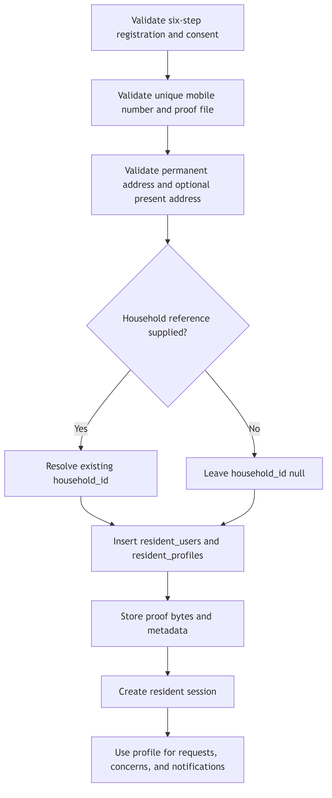

---

## resident_proof_documents

**Purpose:** Stores one private proof-of-residency upload per registered resident. The file bytes are stored in MySQL and are never exposed through the public static-file server.

Mermaid source: resident_proof_documents erd

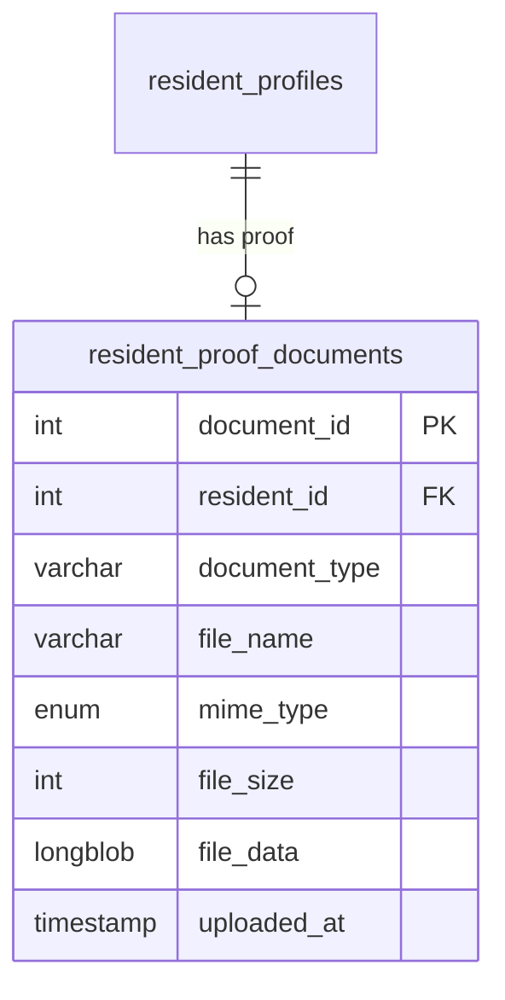
```mermaid
erDiagram
    resident_profiles ||--o| resident_proof_documents : "has proof"

    resident_proof_documents {
        int document_id PK
        int resident_id FK
        varchar document_type
        varchar file_name
        enum mime_type
        int file_size
        longblob file_data
        timestamp uploaded_at
    }
```

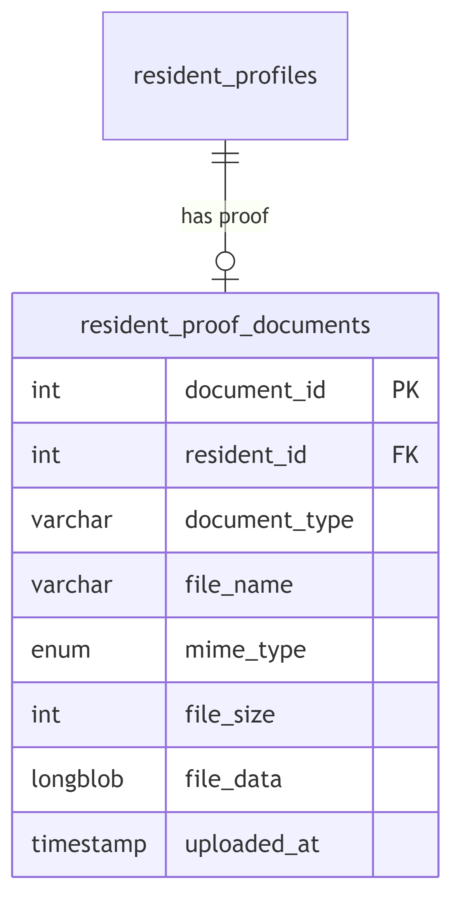

Mermaid source: resident_proof_documents flowchart

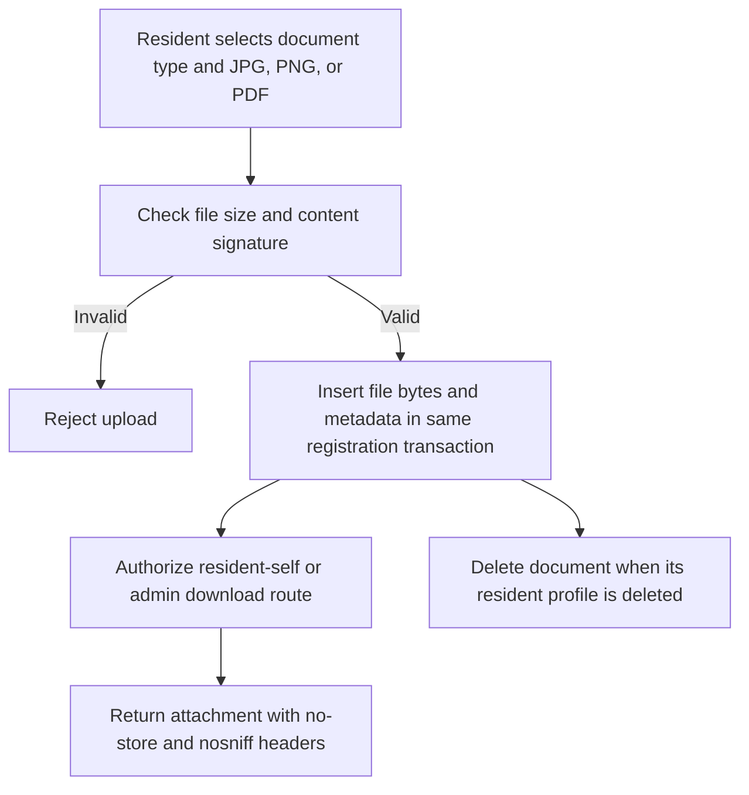
```mermaid
flowchart TD
    A[Resident selects document type and JPG, PNG, or PDF] --> B[Check file size and content signature]
    B -->|Invalid| C[Reject upload]
    B -->|Valid| D[Insert file bytes and metadata in same registration transaction]
    D --> E[Authorize resident-self or admin download route]
    E --> F[Return attachment with no-store and nosniff headers]
    D --> G[Delete document when its resident profile is deleted]
```

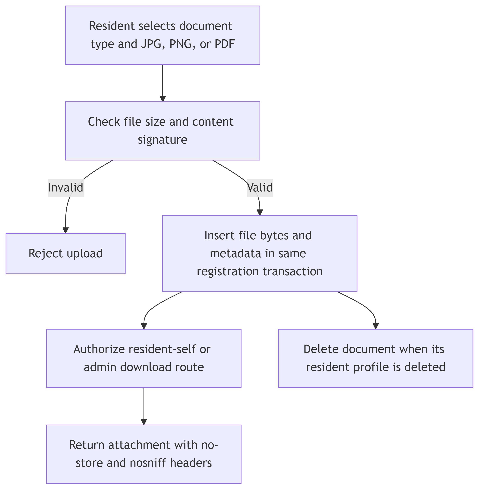

---

## admin_users

**Purpose:** Stores staff and administrator credentials and profile details.

Mermaid source: admin_users erd

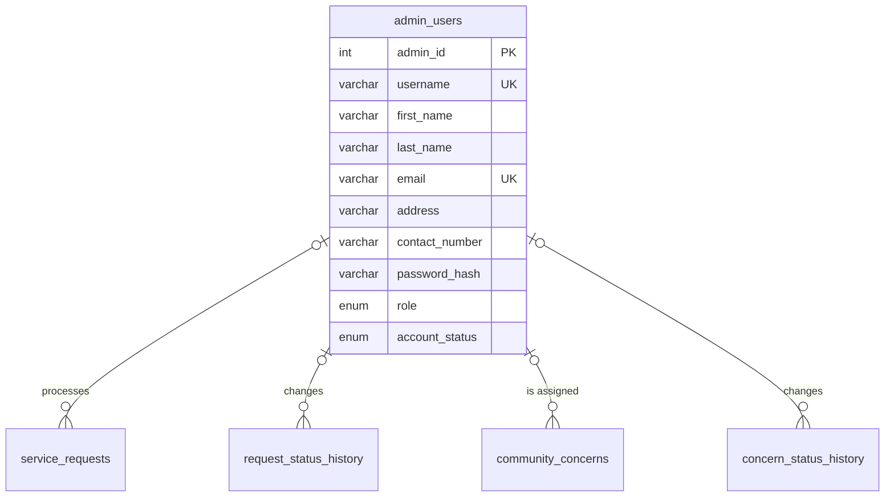
```mermaid
erDiagram
    admin_users o|--o{ service_requests : "processes"
    admin_users o|--o{ request_status_history : "changes"
    admin_users o|--o{ community_concerns : "is assigned"
    admin_users o|--o{ concern_status_history : "changes"

    admin_users {
        int admin_id PK
        varchar username UK
        varchar first_name
        varchar last_name
        varchar email UK
        varchar address
        varchar contact_number
        varchar password_hash
        enum role
        enum account_status
    }
```

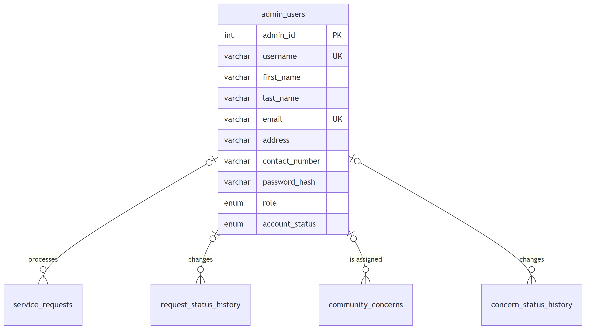

Mermaid source: admin_users flowchart

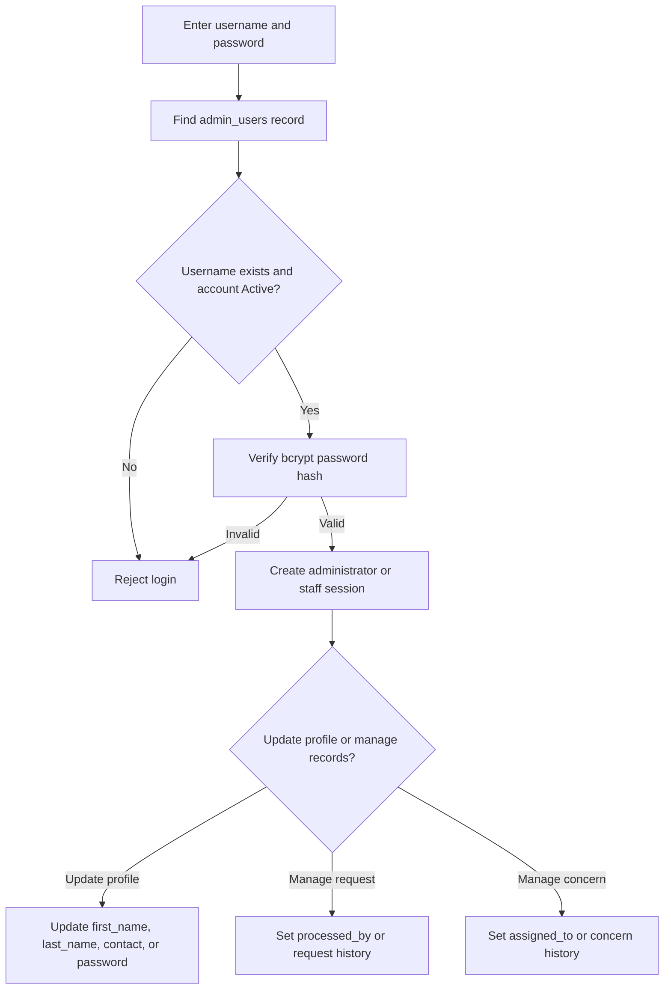
```mermaid
flowchart TD
    A[Enter username and password] --> B[Find admin_users record]
    B --> C{Username exists and account Active?}
    C -->|No| D[Reject login]
    C -->|Yes| E[Verify bcrypt password hash]
    E -->|Invalid| D
    E -->|Valid| F[Create administrator or staff session]
    F --> G{Update profile or manage records?}
    G -->|Update profile| H[Update first_name, last_name, contact, or password]
    G -->|Manage request| I[Set processed_by or request history]
    G -->|Manage concern| J[Set assigned_to or concern history]
```

---

## service_types

**Purpose:** Provides normalized lookup data for service names and standard fees.

Mermaid source: service_types erd

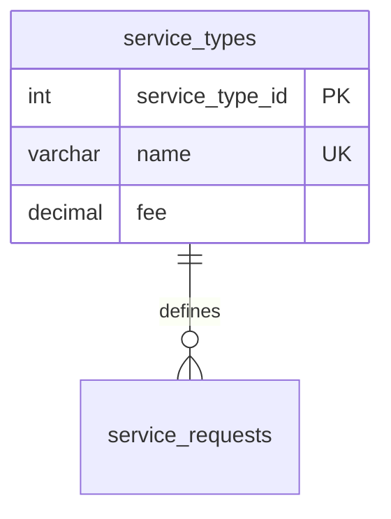
```mermaid
erDiagram
    service_types ||--o{ service_requests : "defines"

    service_types {
        int service_type_id PK
        varchar name UK
        decimal fee
    }
```

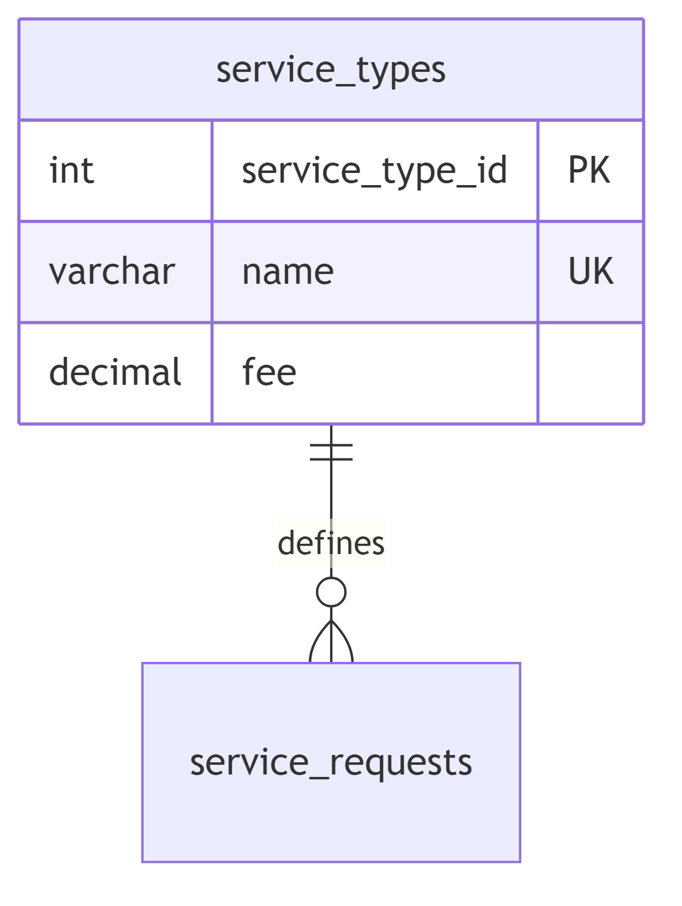

Mermaid source: service_types flowchart

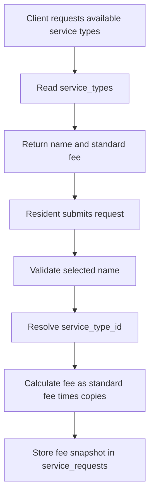
```mermaid
flowchart TD
    A[Client requests available service types] --> B[Read service_types]
    B --> C[Return name and standard fee]
    C --> D[Resident submits request]
    D --> E[Validate selected name]
    E --> F[Resolve service_type_id]
    F --> G[Calculate fee as standard fee times copies]
    G --> H[Store fee snapshot in service_requests]
```

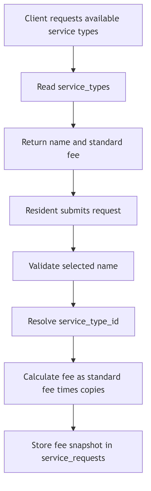

---

## service_requests

**Purpose:** Stores resident service/certificate requests and their current processing state.

Mermaid source: service_requests erd

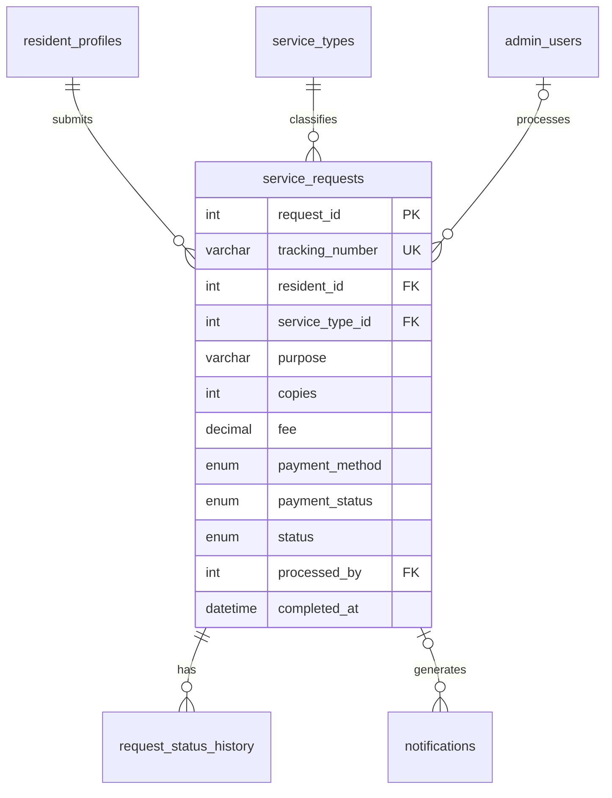
```mermaid
erDiagram
    resident_profiles ||--o{ service_requests : "submits"
    service_types ||--o{ service_requests : "classifies"
    admin_users o|--o{ service_requests : "processes"
    service_requests ||--o{ request_status_history : "has"
    service_requests o|--o{ notifications : "generates"

    service_requests {
        int request_id PK
        varchar tracking_number UK
        int resident_id FK
        int service_type_id FK
        varchar purpose
        int copies
        decimal fee
        enum payment_method
        enum payment_status
        enum status
        int processed_by FK
        datetime completed_at
    }
```

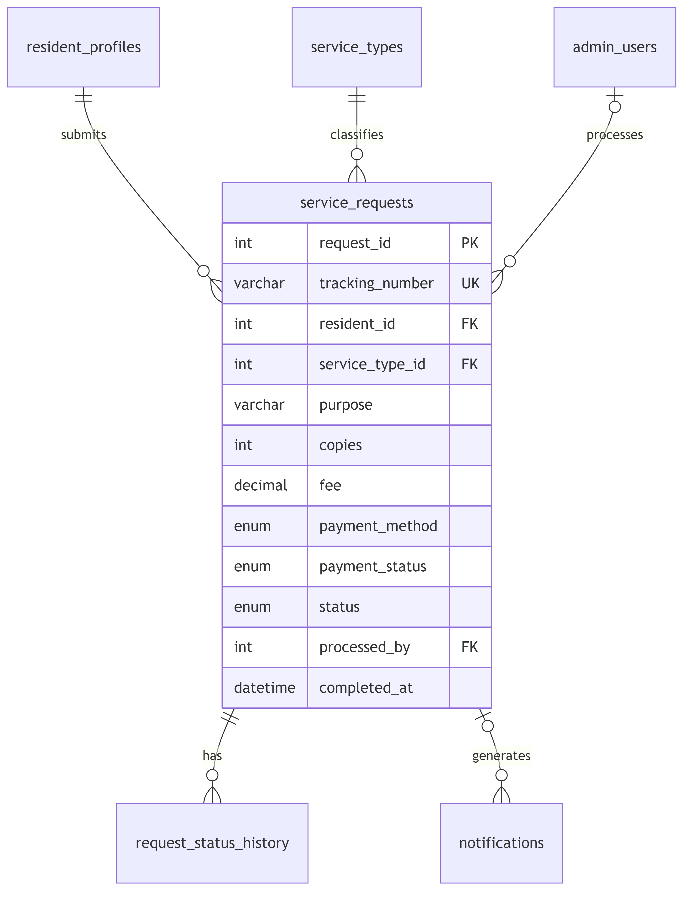

Mermaid source: service_requests flowchart

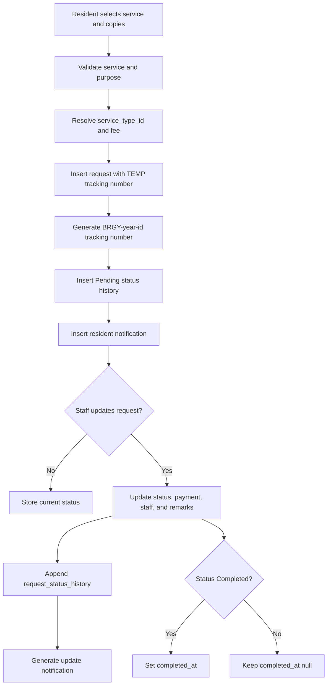
```mermaid
flowchart TD
    A[Resident selects service and copies] --> B[Validate service and purpose]
    B --> C[Resolve service_type_id and fee]
    C --> D[Insert request with TEMP tracking number]
    D --> E[Generate BRGY-year-id tracking number]
    E --> F[Insert Pending status history]
    F --> G[Insert resident notification]
    G --> H{Staff updates request?}
    H -->|No| I[Store current status]
    H -->|Yes| J[Update status, payment, staff, and remarks]
    J --> K[Append request_status_history]
    K --> L[Generate update notification]
    J --> M{Status Completed?}
    M -->|Yes| N[Set completed_at]
    M -->|No| O[Keep completed_at null]
```

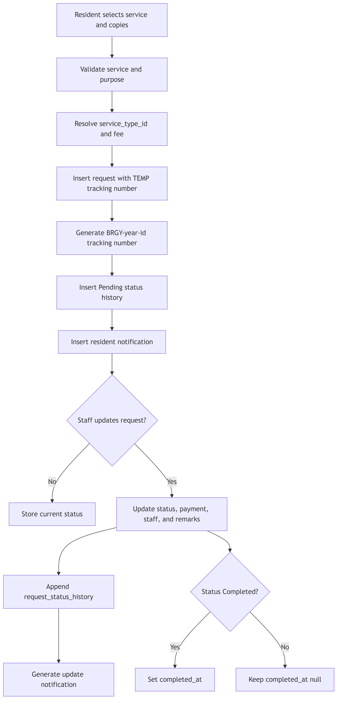

---

## request_status_history

**Purpose:** Keeps an append-only record of request status changes.

Mermaid source: request_status_history erd

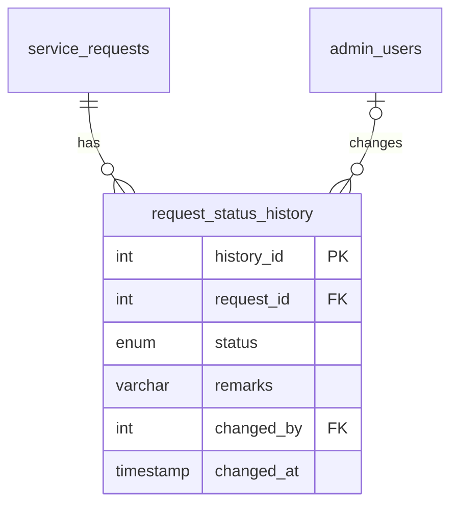
```mermaid
erDiagram
    service_requests ||--o{ request_status_history : "has"
    admin_users o|--o{ request_status_history : "changes"

    request_status_history {
        int history_id PK
        int request_id FK
        enum status
        varchar remarks
        int changed_by FK
        timestamp changed_at
    }
```

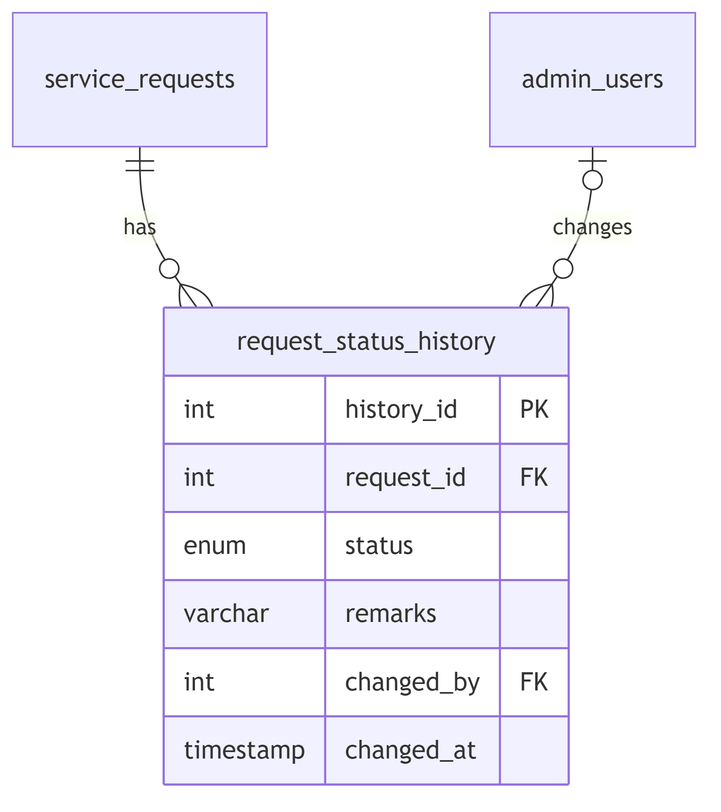

Mermaid source: request_status_history flowchart

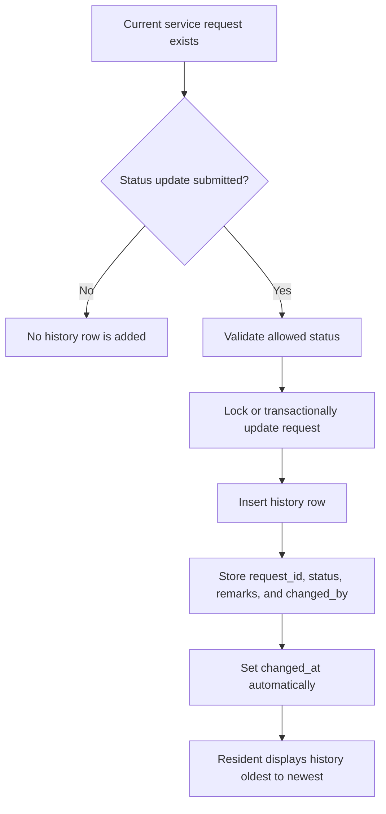
```mermaid
flowchart TD
    A[Current service request exists] --> B{Status update submitted?}
    B -->|No| C[No history row is added]
    B -->|Yes| D[Validate allowed status]
    D --> E[Lock or transactionally update request]
    E --> F[Insert history row]
    F --> G[Store request_id, status, remarks, and changed_by]
    G --> H[Set changed_at automatically]
    H --> I[Resident displays history oldest to newest]
```

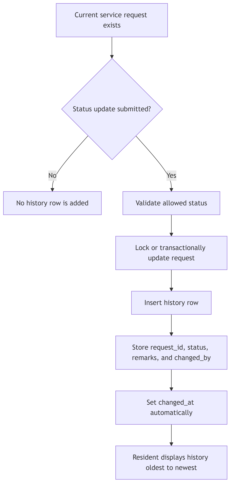

---

## notifications

**Purpose:** Stores notifications related to service requests for residents.

Mermaid source: notifications erd

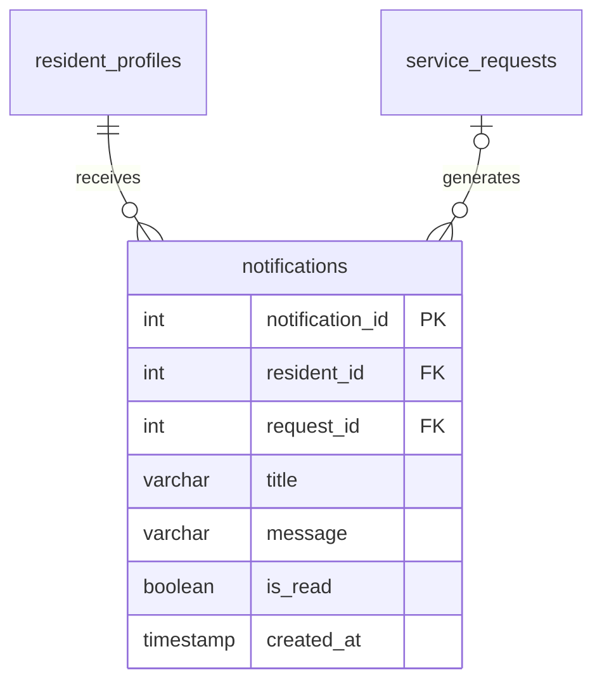
```mermaid
erDiagram
    resident_profiles ||--o{ notifications : "receives"
    service_requests o|--o{ notifications : "generates"

    notifications {
        int notification_id PK
        int resident_id FK
        int request_id FK
        varchar title
        varchar message
        boolean is_read
        timestamp created_at
    }
```

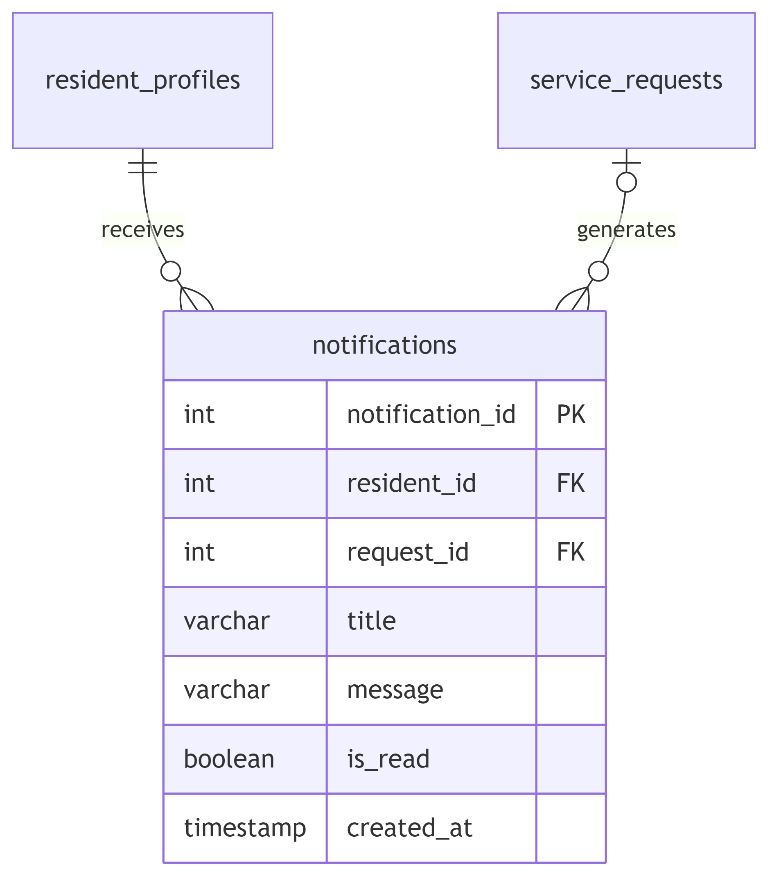

Mermaid source: notifications flowchart

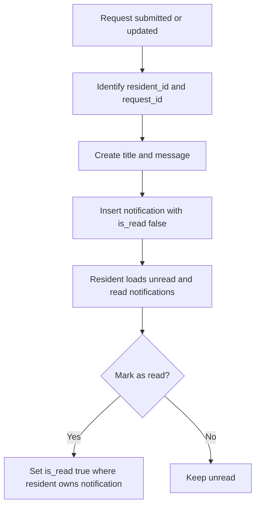
```mermaid
flowchart TD
    A[Request submitted or updated] --> B[Identify resident_id and request_id]
    B --> C[Create title and message]
    C --> D[Insert notification with is_read false]
    D --> E[Resident loads unread and read notifications]
    E --> F{Mark as read?}
    F -->|Yes| G[Set is_read true where resident owns notification]
    F -->|No| H[Keep unread]
```

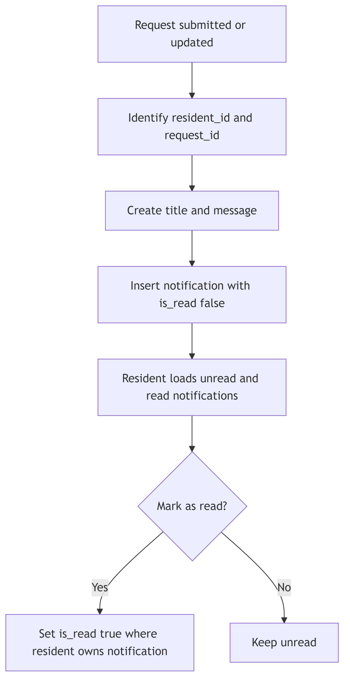

---

## community_concerns

**Purpose:** Stores reported community concerns and their current assignment/status.

Mermaid source: community_concerns erd

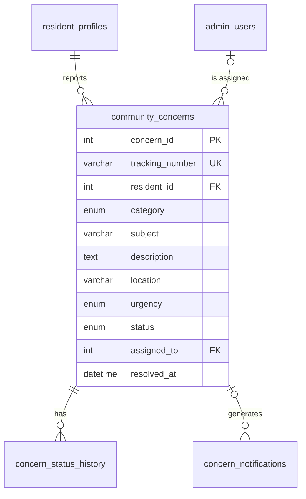
```mermaid
erDiagram
    resident_profiles ||--o{ community_concerns : "reports"
    admin_users o|--o{ community_concerns : "is assigned"
    community_concerns ||--o{ concern_status_history : "has"
    community_concerns o|--o{ concern_notifications : "generates"

    community_concerns {
        int concern_id PK
        varchar tracking_number UK
        int resident_id FK
        enum category
        varchar subject
        text description
        varchar location
        enum urgency
        enum status
        int assigned_to FK
        datetime resolved_at
    }
```

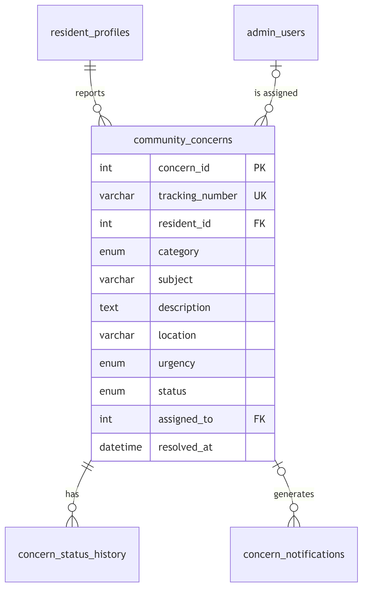

Mermaid source: community_concerns flowchart

```mermaid
flowchart TD
    A[Resident submits concern details] --> B[Validate category, urgency, subject, description, location]
    B --> C[Insert concern with TEMP tracking number]
    C --> D[Generate CON-year-id tracking number]
    D --> E[Insert Submitted status history]
    E --> F[Insert concern notification]
    F --> G{Staff updates concern?}
    G -->|No| H[Retain current status]
    G -->|Yes| I[Validate status and assigned staff]
    I --> J[Update status, assigned_to, remarks]
    J --> K{Resolved?}
    K -->|Yes| L[Set resolved_at]
    K -->|No| M[Set resolved_at null]
    L --> N[Append concern_status_history]
    M --> N
    N --> O[Insert update notification]
```

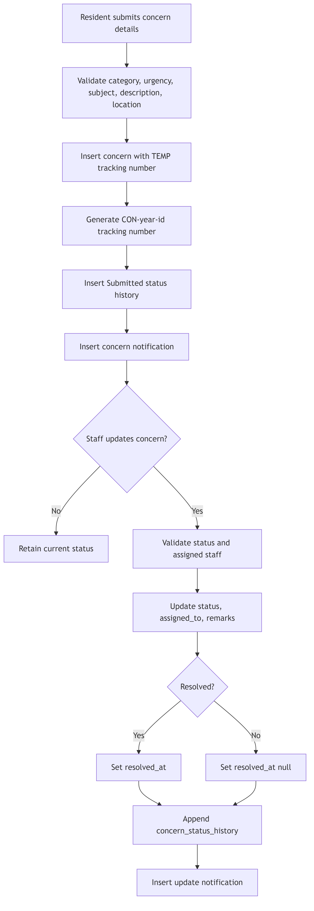

---

## concern_status_history

**Purpose:** Keeps an append-only record of concern status and assignment changes.

Mermaid source: concern_status_history erd

```mermaid
erDiagram
    community_concerns ||--o{ concern_status_history : "has"
    admin_users o|--o{ concern_status_history : "changes"

    concern_status_history {
        int history_id PK
        int concern_id FK
        enum status
        varchar remarks
        int changed_by FK
        timestamp changed_at
    }
```

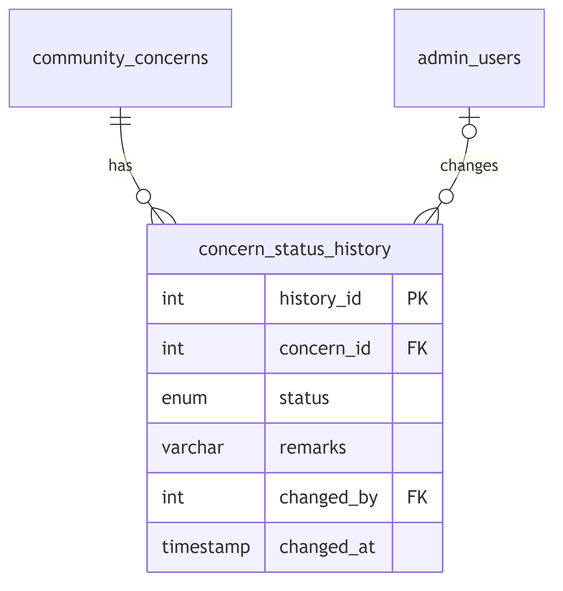

Mermaid source: concern_status_history flowchart

```mermaid
flowchart TD
    A[Concern exists] --> B{Staff submits a valid status update?}
    B -->|No| C[Reject update]
    B -->|Yes| D[Begin database transaction]
    D --> E[Update concern current state]
    E --> F[Insert history row]
    F --> G[Store concern_id, status, remarks, changed_by]
    G --> H[Commit transaction]
    H --> I[Display chronological history to resident and staff]
```

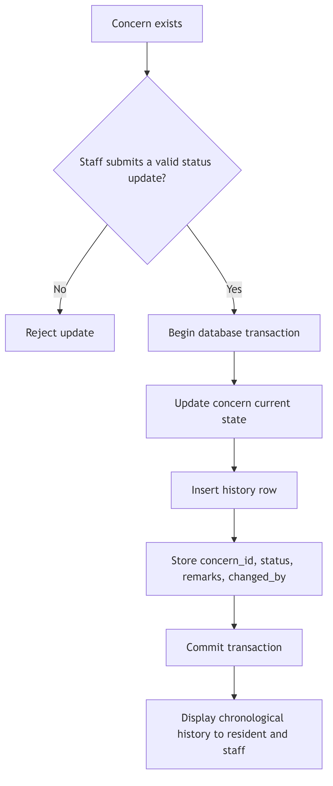

---

## concern_notifications

**Purpose:** Stores notifications related to community concerns.

Mermaid source: concern_notifications erd

```mermaid
erDiagram
    resident_profiles ||--o{ concern_notifications : "receives"
    community_concerns o|--o{ concern_notifications : "generates"

    concern_notifications {
        int notification_id PK
        int resident_id FK
        int concern_id FK
        varchar title
        varchar message
        boolean is_read
        timestamp created_at
    }
```

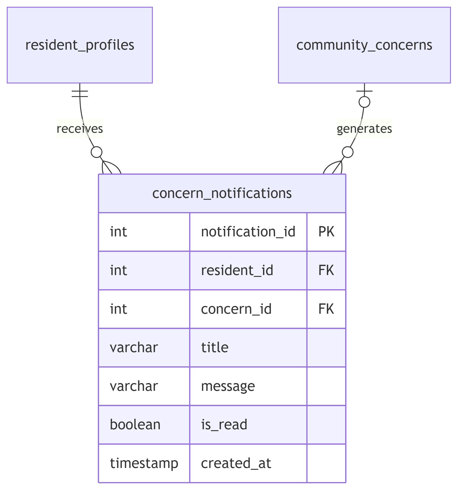

Mermaid source: concern_notifications flowchart

```mermaid
flowchart TD
    A[Concern submitted or updated] --> B[Resolve resident and concern IDs]
    B --> C[Create concern notification]
    C --> D[Insert is_read false]
    D --> E[Resident loads concern notifications]
    E --> F{Mark notification read?}
    F -->|Yes| G[Set is_read true]
    F -->|No| H[Leave notification unread]
```

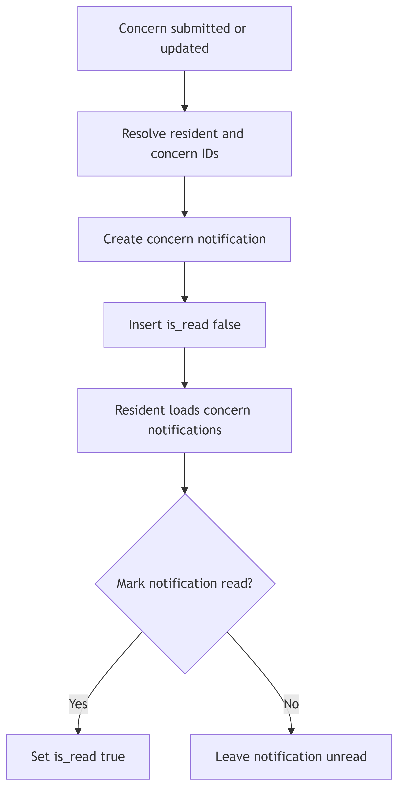

